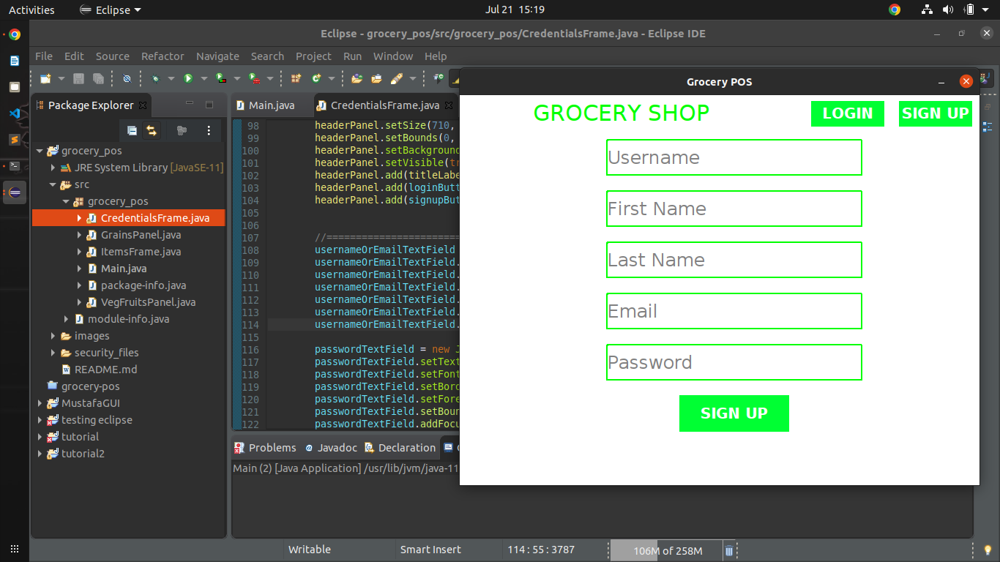

# Grocery APP
## Introduction
This is a long term project built on java. The initial step is to build a stand alone application entirely on Java swing. 
Front end - Java Swing
Back end - Java Database Connectivity JDBC
Build tool - gradle 

## UI/UIX
This is the initial look at the process of developing the standalone app

### Welcome page

Contains the login and sign up that leads one to credentials. The login and sing up buttons leads to their respective pages 

### Login Page

### Sign up page 

After verifying the credeantials, the items pages are dislayed. The default one being the fruits and vegetables page 
### Fruits and Vegetable page 

### Grains 
This is the grains panel page

# FINAL STANDALONE UI/UX

